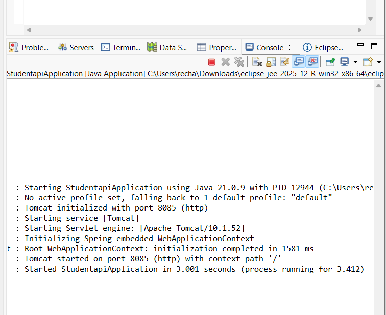
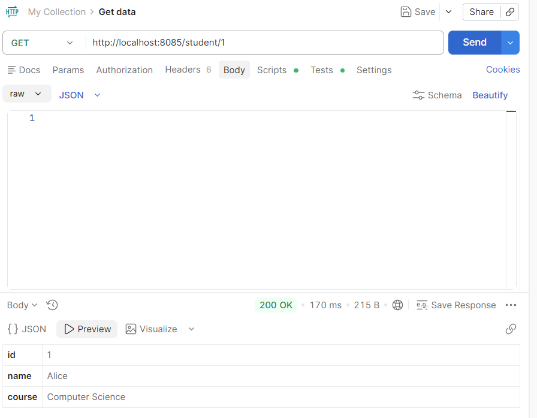
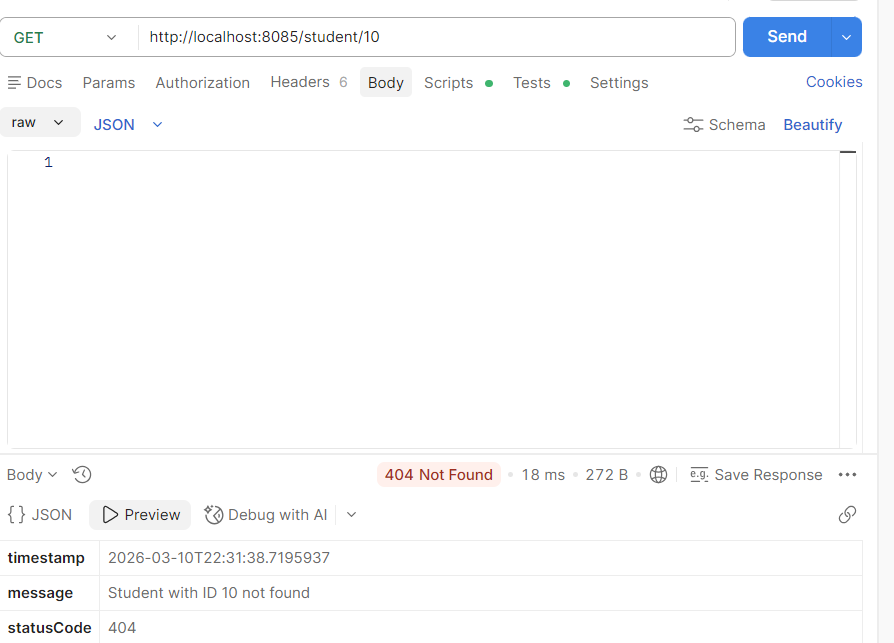
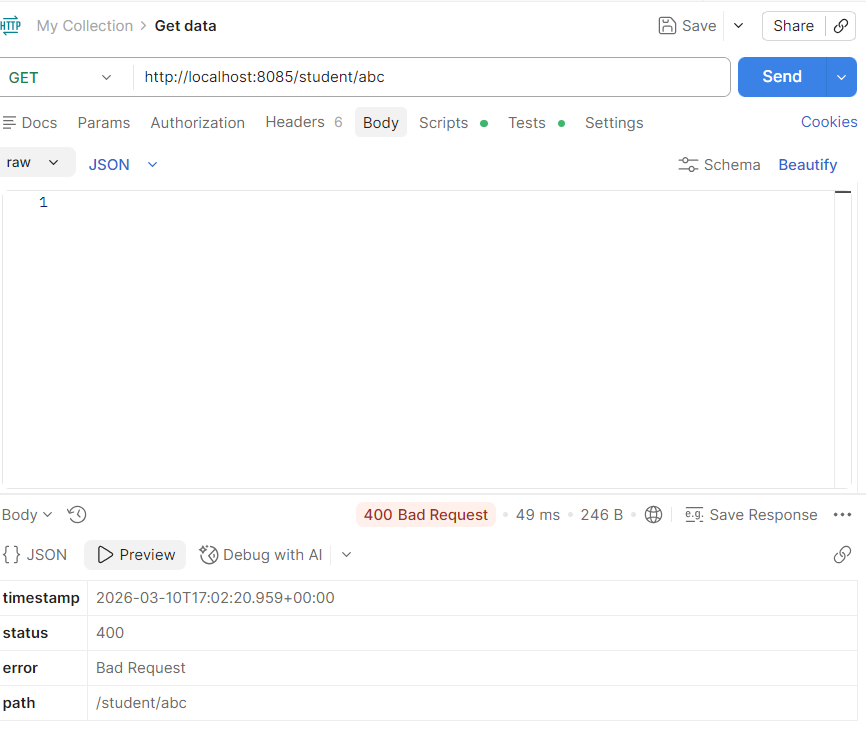

# Experiment 9 – Global Exception Handling using @ControllerAdvice

## Course

Full Stack Application Development (FSAD) Lab

---

## Objective

To implement global exception handling in a Spring Boot REST API using `@ControllerAdvice` and custom exception classes to provide user-friendly error responses.

---

## Description

In many REST APIs, technical error messages are returned when invalid inputs are provided. This experiment demonstrates how to create custom exceptions and handle them globally using `@ControllerAdvice`. A student information API is developed where the system throws meaningful error responses when an invalid student ID or incorrect input is provided.

---

## Technologies Used

* Java
* Spring Boot
* REST API
* Maven
* Eclipse IDE
* Postman

---

## Project Structure

```id="ps3o3k"
studentapi
 ├── controller
 │     └── StudentController.java
 ├── model
 │     └── Student.java
 ├── exception
 │     ├── StudentNotFoundException.java
 │     ├── InvalidInputException.java
 │     ├── ErrorResponse.java
 │     └── GlobalExceptionHandler.java
 └── StudentapiApplication.java
```

---

## Application Startup

The Spring Boot application starts successfully and initializes the embedded Tomcat server.



---

## REST API Endpoint

### Get Student by ID

```id="pyrp8h"
/student/{id}
```

This endpoint retrieves student information based on the provided ID.

---

## Exception Handling

Two custom exceptions are implemented:

* **StudentNotFoundException** – triggered when the student ID does not exist.
* **InvalidInputException** – triggered when invalid input is provided.

Global exception handling is implemented using `@ControllerAdvice`.

---

## API Testing using Postman

### 1. Valid Student ID

Example request:

```id="q7k12s"
GET /student/1
```

Response returns student details.



---

### 2. Student Not Found Exception

Example request:

```id="fr4g0q"
GET /student/10
```

Response returns a structured error message.



---

### 3. Invalid Input Exception

Example request:

```id="awvl9p"
GET /student/abc
```

Response returns an invalid input error message.



---

## Error Response Structure

The API returns structured JSON error responses with the following fields:

| Field      | Description                  |
| ---------- | ---------------------------- |
| timestamp  | Time when the error occurred |
| message    | Error message                |
| statusCode | HTTP status code             |

Example:

```id="aqyn8h"
{
 "timestamp":"2026-03-10T22:30:45",
 "message":"Student with ID 10 not found",
 "statusCode":404
}
```

---

## Result

The REST API successfully handled exceptions using global exception handling with `@ControllerAdvice`. User-friendly error responses were returned for invalid student IDs and incorrect input formats.

---

## Conclusion

Global exception handling improves the usability and readability of REST APIs by providing meaningful error messages instead of technical stack traces. Using `@ControllerAdvice` allows centralized management of exceptions across the application.
